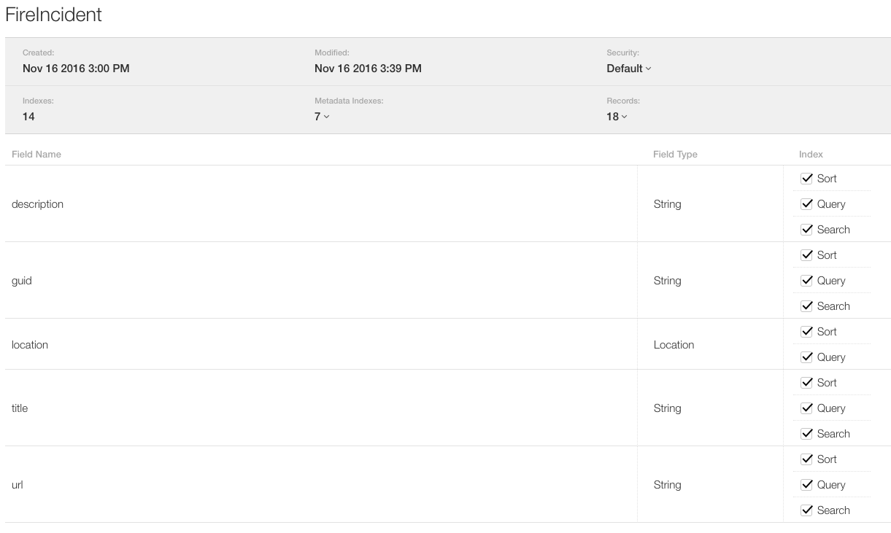

# OpenCloudKit Server Import JSON Feed Example

This is an example Swift server project that demonstrates how to import a JSON feed into CloudKit using OpenCloudKit and Vapor. This example imports fire incidents from the [RFS NSW Major Incidents Feed
](http://www.rfs.nsw.gov.au/feeds/majorIncidents.json).

## Setup

You'll need to provide your CloudKit configuration settings with Server-to-Server auth information in the main project directory named 'cloudkit.json'. In addition to this, you will need to add your private key in the main directory named 'eckey.pem'.

### Additional required Files
Add to main directory
* cloudkit.json - CloudKit configuration
* eckey.pem - Private key for signing requests

### Container Setup

In order for iCloud to accept the FireIncident records. You'll need to add the 'FireIncident' record type to your container. Use the below screenshot as a guide for the required fields.

